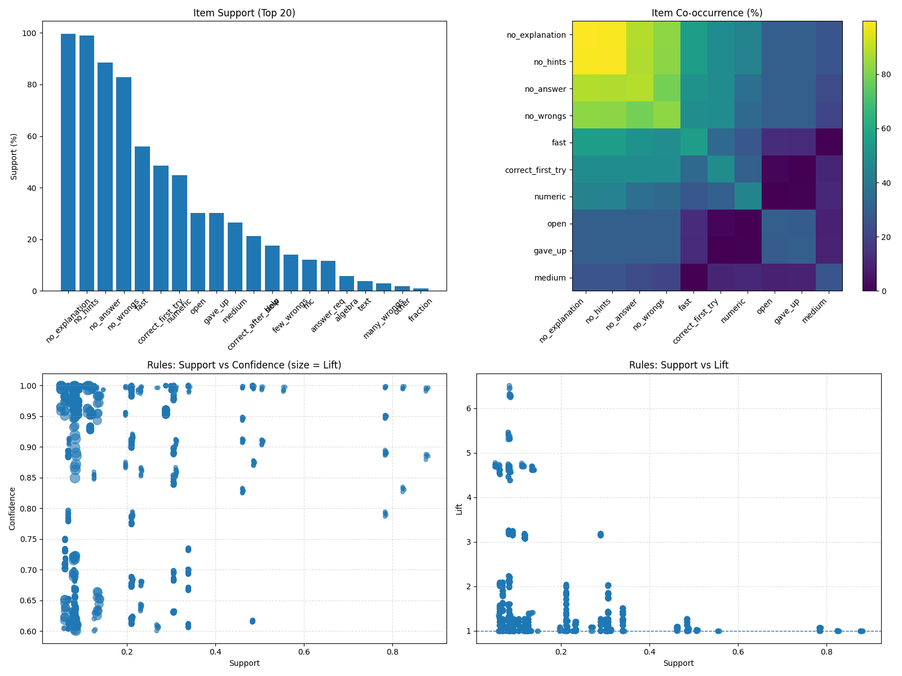
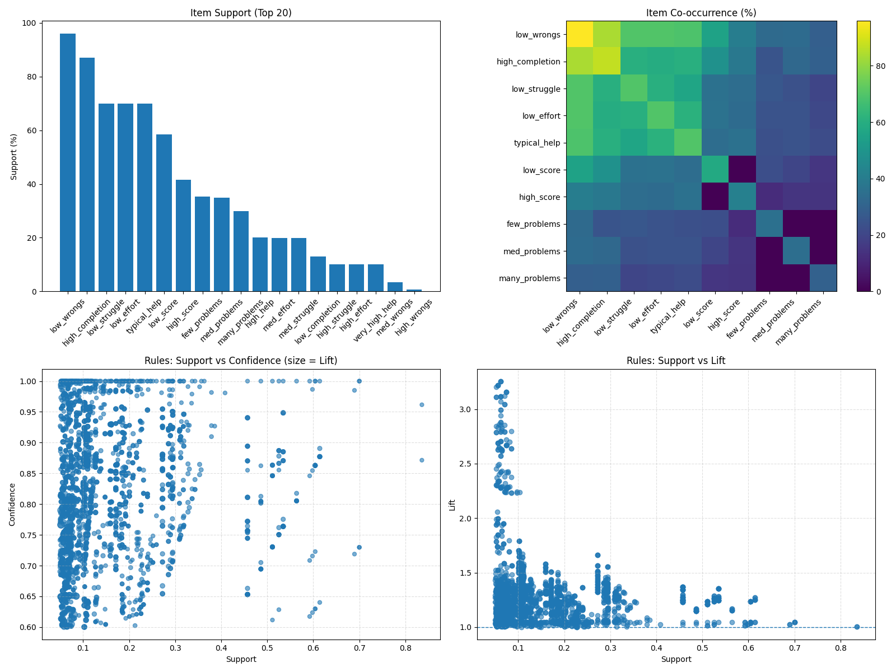
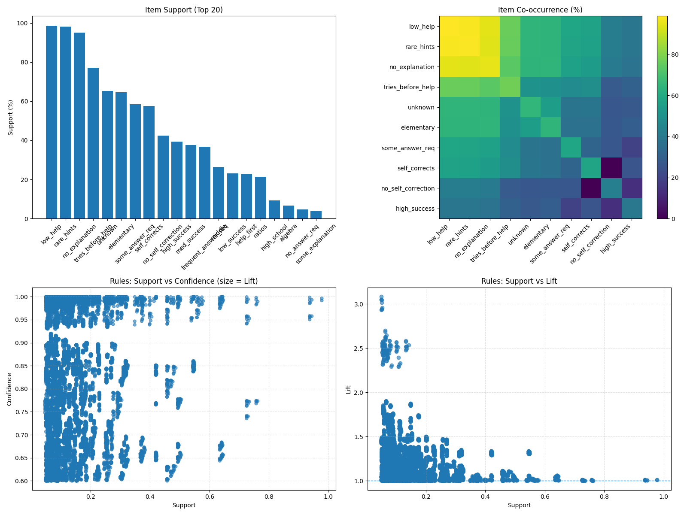

<style>
  table {
    width: 100%; /* Makes the table span the full width of the slide */
    height: 100%; /* Makes the table span the full height (if content allows) */
    font-size: 18px; /* Adjust font size to fit more content if needed */
  }
  p {
    font-size: 22px;
  }
</style>

# Educational Data Mining: Student Learning Behavior Analysis using Apriori Algorithm for the EDM Cup 2023 Dataset

## Caine Ivan R. Bautista (2022-0378)
### BSCS-4 

---
## The Problem

Educational institutions often struggle to understand which specific learning behaviors and help-seeking patterns contribute to student success or failure on assessments. While online learning platforms capture vast amounts of clickstream data, extracting actionable insights that can guide instructional interventions remains challenging.

---

## Dataset
Source: [EDM Cup 2023 - Kaggle Competition](https://www.kaggle.com/competitions/edm-cup-2023/overview)

**Used Dataset Files**
| File | Rows | Columns | Size | Description |
| ---- | ---- | ------- | ---- | ----------- |
| action_logs.csv | 23,932,276 |10 |1.37 GB | Timestamped student actions |
| assignment_details.csv | 9,319,676 | 9 | 921 MB | Assignment metadata | 
| problem_details.csv | 132,738 | 10 | 59 MB | Problem characteristics | 
| training_unit_test_scores.csv | 452,439 | 3 | 10 MB | Unit test outcomes | 
| assignment_relationships.csv | 702,887 | 2 | 14 MB | Unit test <-> in-unit links |
| sequence_details.csv | 10,774 |8 | 3.8 MB | Curriculum structure | 
---

## Conducted Analysis

1. Behavioral Co-occurrence: What problem-solving behaviors (hints, wrong attempts, time spent) naturally occur together during student work sessions?
2. Performance Prediction: Which combinations of aggregated behaviors across multiple assignments predict success or failure on unit tests?
3. Mastery Patterns: What help-seeking patterns distinguish students who achieve mastery from those who continue to struggle?

---
## Data Cleaning
 
| Column | Type | Description | Example Values |
|--------|------|-------------|----------------|
| `action` | categorical | Student interaction type | `problem_started`, `wrong_response`, `correct_response`, `hint_requested`, `explanation_requested`, `answer_requested`,`problem_finished` |
| `timestamp` | float | Unix epoch time | `1599150990.0` |
| `problem_id` | string | Unique problem identifier | `I2GX4OQIE` |
| `problem_type` | categorical | Question format | `Multiple Choice`, `Numeric`, `Algebraic Expression` |
| `problem_skill_code` | string | Common Core standard | `6.RP.A.3b`, `8.EE.A.1-1` |
| `score` | binary | Unit test outcome | `0` (fail), `1` (pass) |

---

# Methods
Each analysis required different aggregation and feature engineering to acquire the nessesary categories as shown below:
```python
def aggregate_attempts(group, assignment_log_id, problem_id):
    if not (group['action'] == 'problem_finished').any():
        return None
    started = group.loc[group['action'] == 'problem_started', 'timestamp'].min()
    finished = group.loc[group['action'] == 'problem_finished', 'timestamp'].max()
    if pd.isna(started) or pd.isna(finished):
        return None
    time_spent = finished - started
    hint_count = (group['action'] == 'hint_requested').sum()
    wrong_count = (group['action'] == 'wrong_response').sum()
    correct_count = (group['action'] == 'correct_response').sum()
    answer_requested = (group['action'] == 'answer_requested').any()
    explanation_requested = (group['action'] == 'explanation_requested').any()
    ...
```
---
```python
def action_problem_transactions(transactions):
    transactions = transactions.copy()
    transactions['hints'] = pd.cut(
        transactions['hint_count'],
        bins=[-0.1, 0, 2, np.inf],
        labels=['no_hints', 'few_hints', 'many_hints']
    )
    transactions['wrongs'] = pd.cut(
        transactions['wrong_count'],
        bins=[-0.1, 0, 2, np.inf],
        labels=['no_wrongs', 'few_wrongs', 'many_wrongs']
    )
    ...
```

---
## Apriori Configuration
```python
@dataclass
class AnalysisConfig:
    """Apriori analysis parameters"""
    min_support: float = 0.05
    min_confidence: float = 0.6
    min_lift: float = 1.0
    top_n_rules: int = 10
```
---
## Results (Student-Problem Interactions)

**Visualization**


---

**Top 5 Itemsets**
| Rank | Itemset | Support | Interpretation | 
|-|-|-|-|
| 1 | {no_explanation} | 0.996 | Nearly all avoid explanations | 
| 2 | {no_hints} | 0.990 | Hints rarely used | 
| 3 | {no_explanation, no_hints} | 0.986 | Minimal help-seeking | 
| 4 | {no_answer} | 0.884 | Answer key rarely viewed |
| 5 | {no_answer, no_explanation} | 0.881 | Help resources ignored |
 
---

**Top 5 Association Rules:**
| Rank | Rule | Support | Confidence | Lift | Interpretation|
|-|-|-|-|-|-|
| 1 | {correct_after_help, no_hints, no_answer, no_explanation} → {few_wrongs} | 0.083 | 0.919 | 6.509 | Students who succeed with no help had few errors | 
| 2 | {correct_after_help, no_hints, no_answer} → {few_wrongs} | 0.084 | 0.913 | 6.467 | Same pattern without explanation filter | 
| 3 | {correct_after_help, no_hints, no_answer} → {no_explanation, few_wrongs} | 0.083 | 0.899 | 6.442 | Reinforces explanation avoidance | 
| 4 | {correct_after_help, no_answer, no_explanation} → {no_hints, few_wrongs} | 0.083 | 0.867 | 6.323 | Hints unnecessary when successful | 
| 5 | {no_hints, few_wrongs} → {correct_after_help, no_answer, no_explanation} | 0.083 | 0.602 | 6.323 | Reverse: few errors predict success | 

---

## Analysis 1 Key Findings
- Self-directed success: Students who eventually succeed (correct_after_help) overwhelmingly avoid hints, answers, and explanations (lift 6.3-6.5×)
- Few errors matter: Rules consistently highlight few_wrongs (0-2 errors) as a strong predictor of eventual correctness
- Help paradox: The strongest associations involve not using help resources, suggesting either:
  1. Successful students don't need help
  2. Help-seeking occurs only when deeply struggling (not captured in "correct_after_help" outcome)
- Problem type irrelevance: No strong rules involve problem_type, suggesting behavior patterns transcend question format

---

## Results (Student-Unit Aggregations)

**Visualization**


---

**Top 5 Itemsets**
| Rank | Itemset | Support | Interpretation | 
|-|-|-|-|
| 1 | {low_wrongs} | 0.959 | Nearly all have minimal errors | 
| 2 | {high_completion} | 0.869 | Most complete assigned work | 
| 3 | {high_completion, low_wrongs} | 0.836 | Success duo: completion + accuracy | 
| 4 | {low_effort, low_wrongs} | 0.700 | Minimal interactions with few errors | 
| 5 | {low_effort} | 0.700 | Standard effort level | 

---

**Top 5 Association Rules:**
| Rank | Rule | Support | Confidence | Lift | Interpretation|
|-|-|-|-|-|-|
| 1 | {low_wrongs, low_struggle, typical_help, low_completion} → {low_effort, few_problems} | 0.062 | 0.803 | 3.258 | Low completion + typical help → low effort on few problems |
| 2 | {low_struggle, typical_help, low_completion} → {low_effort, low_wrongs, few_problems} | 0.062 | 0.803 | 3.258 | Same pattern emphasizing accuracy | 
| 3 | {low_struggle, typical_help, low_completion} → {low_effort, few_problems} | 0.062 | 0.803 | 3.258 | Core low-completion pattern | 
| 4 | {low_completion, low_struggle, low_score} → {low_effort, few_problems} | 0.056 | 0.794 | 3.221 | Low score adds to pattern |
| 5 | {low_struggle, low_wrongs, low_completion, low_score} → {low_effort, few_problems} | 0.056 | 0.794 | 3.221 | Full struggling student profile | 

---

## Analysis 2 Key Findings
- Low completion trap: Students with low_completion (<70% finished) strongly associate with few_problems and low_effort (lift ~3.2×), forming a disengagement profile
- Score paradox: Rules emphasize low_score patterns, but lack symmetric high_score rules due to balanced dataset (50/50 split)
- Help-seeking neutrality: typical_help appears in rules without strong directional effect on outcomes
- Effort-completion link: High completion_rate breaks the low_effort → few_problems cycle, suggesting completion as a key intervention target

---

## Results (Help-Seeking Patterns)

**Visualization**


---

**Top 5 Itemsets**
| Rank | Itemset | Support | Interpretation | 
|-|-|-|-|
| 1 | {low_help} | 0.986 | Help-seekers still use minimal resources | 
| 2 | {rare_hints} | 0.982 | <0.5 hints per problem | 
| 3 | {low_help, rare_hints} | 0.978 | Double minimal-use pattern |
| 4 | {no_explanation} | 0.951 | Explanations almost never used |
| 5 | {low_help, no_explanation} | 0.945 | Help comes from hints/answers, not explanations | 

---

**Top 5 Association Rules:**
| Rank | Rule | Support | Confidence | Lift | Interpretation|
|-|-|-|-|-|-|
| 1 | {algebra, low_help} → {middle, rare_hints} | 0.050 | 0.764 | 3.082 | Middle school algebra uses minimal hints | 
| 2 | {algebra, rare_hints} → {middle, low_help} | 0.050 | 0.767 | 3.050 | Algebra students avoid help | 
| 3 | {algebra} → {middle, rare_hints, low_help} | 0.050 | 0.748 | 3.049 | Core algebra-middle school pattern |
| 4 | {algebra} → {middle, rare_hints} | 0.051 | 0.755 | 3.045 | Algebra = rare hints |
| 5 | {algebra} → {middle, low_help} | 0.051 | 0.758 | 3.016 | Algebra = low help | 

---

## Analysis 3 Key Findings
- Curriculum dominance: Strongest rules involve subject-grade associations (algebra→middle school) rather than help-seeking→success patterns
- Elementary-middle divide: Rules cluster by grade level, suggesting different help-seeking cultures:
  - Elementary: More help_first behavior
  - Middle school: More tries_before_help + algebra
- Success pattern absence: No strong rules linking help strategies to high_success outcome, possibly due to:
  1. Selection bias (analysis only includes help-seekers, excluding successful non-help-seekers)
  2. Help-seeking as a distress signal rather than strategy
- Self-correction irrelevance: self_corrects appears in few rules, suggesting observed sequences don't capture learning

--- 

## Educational Insights
The Apriori analysis reveals a dominant “silent majority” pattern in which students overwhelmingly avoid platform-provided help. Across all analyses, most problem attempts involve no hints, answers, or explanations, and even designated help-seekers typically use minimal assistance. Notably, some of the strongest associations show that students who eventually succeed appear to do so while avoiding in-platform help altogether, suggesting that effective support may occur outside the learning system (e.g., peers, parents, or external resources). This highlights a key limitation of clickstream data: platform logs capture only one channel of a broader, multi-channel learning ecosystem.

More critically, the analysis identifies completion rate as a stronger and more actionable predictor of academic outcomes than help-seeking behavior. Low completion is tightly linked to low effort, fewer attempted problems, and poor unit test performance, forming a self-reinforcing disengagement cycle. Effort alone is ambiguous—low effort can signal mastery when paired with high completion, or disengagement when paired with low completion—underscoring the need for contextual interpretation. Additionally, help-seeking behaviors vary by subject and grade level, indicating that effective interventions must be developmentally and curriculum-specific. Overall, these findings suggest that early completion monitoring and contextualized behavioral metrics are more effective intervention targets than simply encouraging increased help usage.