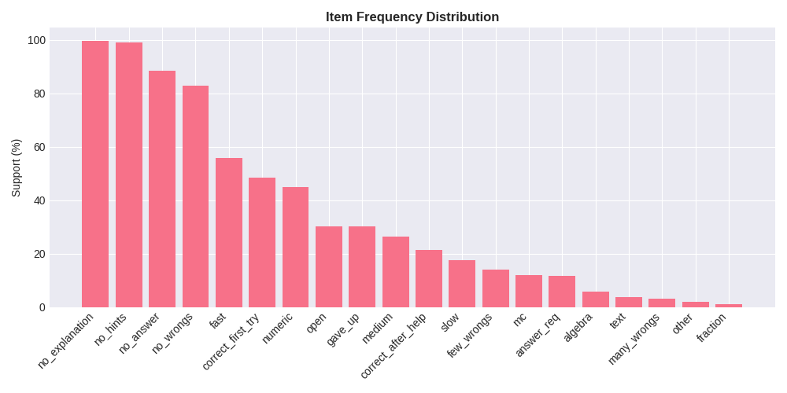

# CSC172 Association Rule Mining Project Progress Report
**Student:** Caine Ivan R. Bautista, 2022-0378
**Date:** December 16, 2025  
**Repository:** https://github.com/caineirb/CSC172-AssociationMining-Bautista

## 📊 Current Status
| Milestone | Status | Notes |
|-----------|--------|-------|
| Dataset Preparation | ✅ Completed | More than 5 million transactions processed |
| Data Preprocessing | ✅ Completed | Ensure proper memory management and saving dataframes after processing |
| EDA & Visualization | ⏳ Not Started | Planned Tomorrow |
| Apriori Implementation | ✅ Completed | Done |
| Rule Evaluation | ✅ Completed | Done |

## 1. Dataset Progress
- **Total transactions:** 5,140,889
- **Unique items:** 24 (support > 0.05)
- **Matrix size:** 5,140,889 transactions × 24 items (29.17% density)
- **Preprocessing applied:** 
  * Grouping action_logs by ['assignment_log_id', 'problem_id']
  * Binning applied (9 categories)
  * Basketing applied (7 baskets)
  * One-hot encoding
  * Infrequent item filtering (support > 0.05)

**Sample transaction preview:**
| transaction_id | values | 
|----------------|--------|
| 1000AQM2VK_154L9TTK7O | ['no_hints', 'few_wrongs', 'medium', 'answer_req', 'no_explanation', 'correct_after_help', 'numeric'] |
| 1000AQM2VK_1D21SH7B18 | ['no_hints', 'no_wrongs', 'slow', 'no_answer', 'no_explanation', 'gave_up', 'open'] |
| 1000AQM2VK_1H3QM3Z2VV | ['no_hints', 'no_wrongs', 'fast', 'no_answer', 'no_explanation', 'gave_up', 'open'] |
| 1000AQM2VK_1H3ZH4WT00 | ['no_hints', 'few_wrongs', 'fast', 'answer_req', 'no_explanation', 'correct_after_help', 'numeric'] |
| 1000AQM2VK_1HES7DVPEF | ['no_hints', 'no_wrongs', 'fast', 'no_answer', 'no_explanation', 'gave_up', 'open'] |

## 2. EDA Progress
**Key Findings (so far):**

- Top 5 items: no_explanation (99.6%), no_hints (99.0%), no_answer (88.4%),  no_wrongs (82.8%), fast (55.9%)
- Average basket size: 7.0 items
- 0% transactions contain 1-3 items

**Current Metrics:**
| Metric | Value |
|--------|-------|
| Transactions cleaned | 5,140,889/5,140,889 (100.0%) |
| Sparsity | 70.83% |
| Top item support | no_explanation: 0.996 |

## 3. Challenges Encountered & Solutions
| Issue | Status | Resolution |
|-------|--------|------------|
| Memory usage due to large dataset | ✅ Fixed | Ensure proper memory management and saving dataframes after processing |
| Memory usage during Apriori | ✅ Fixed | Progressive support levels + low_memory mode |
| Large itemset generation | ✅ Fixed | Limited max_len to 3-itemsets |
| High-dimensional data | ✅ Fixed | Grouping then Binning (9 categories) + Basketing (7 patterns) |

## 4. Next Steps (Before Final Submission)
- [ ] Code cleanup
- [ ] Complete co-occurrence heatmap
- [ ] Create rule scatter plot 
- [ ] Record 5-min demo video
- [ ] Write complete README.md 